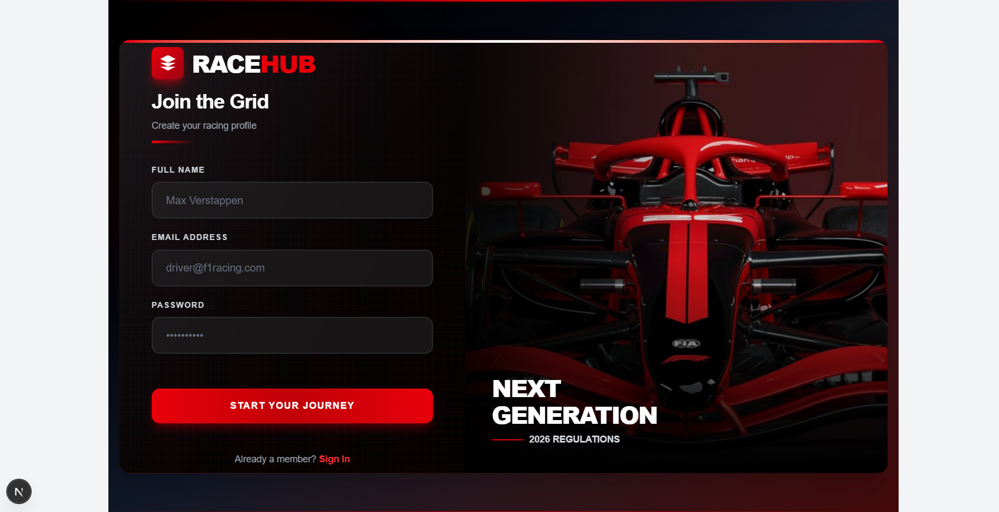

<div align="center">

<!-- PROJECT LOGO -->
<br />
<div style="background: linear-gradient(135deg, #000000 0%, #1a1a1a 100%); padding: 40px; border-radius: 20px; border: 2px solid #dc2626; box-shadow: 0 20px 60px rgba(220, 38, 38, 0.3);">
  
  <!-- RACEHUB LOGO -->
  <svg width="80" height="80" viewBox="0 0 24 24" fill="#dc2626" style="margin-bottom: 20px;">
    <path d="M12 2L2 7l10 5 10-5-10-5zM2 17l10 5 10-5M2 12l10 5 10-5"/>
  </svg>
  
  <h1 style="font-size: 72px; font-weight: 900; color: white; margin: 0; letter-spacing: -2px;">
    RACE<span style="color: #dc2626;">HUB</span>
  </h1>
  
  <p style="color: #9ca3af; font-size: 18px; font-weight: 600; letter-spacing: 4px; margin-top: 10px;">
    FORMULA 1 RACING PLATFORM
  </p>
  
  <div style="width: 100px; height: 3px; background: linear-gradient(90deg, transparent, #dc2626, transparent); margin: 20px auto; border-radius: 2px;"></div>
  
  <p style="color: #d1d5db; font-size: 16px; max-width: 600px; margin: 20px auto 30px; line-height: 1.6;">
    A premium Formula 1 web application featuring stunning authentication flows and an immersive car gallery. Built with modern web technologies and racing-inspired design.
  </p>
  
  <!-- BADGES -->
  <div style="display: flex; gap: 10px; justify-content: center; flex-wrap: wrap; margin-top: 30px;">
    
    
    
    
    
  </div>

</div>

</div>

<br />
<br />

<!-- VISUAL DIVIDER -->
<div align="center">
  
</div>

<br />

<!-- TABLE OF CONTENTS -->
<details open>
  <summary style="font-size: 24px; font-weight: 900; color: #dc2626; cursor: pointer; padding: 15px; background: linear-gradient(135deg, #1a1a1a 0%, #000000 100%); border-radius: 10px; border-left: 5px solid #dc2626;">
    📋 TABLE OF CONTENTS
  </summary>
  <br />
  <ol style="line-height: 2;">
    <li><a href="#-about-the-project">About The Project</a></li>
    <li><a href="#-screenshots">Screenshots</a></li>
    <li><a href="#-features">Features</a></li>
    <li><a href="#-tech-stack">Tech Stack</a></li>
    <li><a href="#-project-structure">Project Structure</a></li>
    <li><a href="#-components-breakdown">Components Breakdown</a></li>
    <li><a href="#-design-elements">Design Elements</a></li>
    <li><a href="#-getting-started">Getting Started</a></li>
    <li><a href="#-usage">Usage</a></li>
    <li><a href="#-roadmap">Roadmap</a></li>
    <li><a href="#-contributing">Contributing</a></li>
    <li><a href="#-license">License</a></li>
    <li><a href="#-contact">Contact</a></li>
  </ol>
</details>

<br />

<!-- ABOUT THE PROJECT -->
## 🏎️ About The Project

<div style="background: linear-gradient(135deg, #0a0a0a 0%, #1a1a1a 100%); padding: 30px; border-radius: 15px; border: 1px solid #333; margin: 20px 0;">

**RaceHub** is a cutting-edge Formula 1 web platform that brings the thrill of racing to your screen. This project showcases a premium user experience with:

- **🔐 Dual Authentication System**: Sleek sliding login/signup interface with real-time validation
- **🏁 Interactive F1 Car Gallery**: Browse through 10 legendary F1 cars from the 2023 season
- **⚡ Modern UI/UX**: Racing-inspired design with smooth animations and transitions
- **📱 Fully Responsive**: Optimized for all devices from mobile to desktop
- **🎨 Premium Aesthetics**: Dark theme with signature F1 red accents and glassmorphism

<br />

### Built With Passion For

```
🏆 Formula 1 Enthusiasts
💻 Modern Web Development
🎨 Exceptional UI/UX Design
⚡ Peak Performance
```

</div>

<br />

<!-- SCREENSHOTS SECTION -->
## 📸 Screenshots

<div style="background: #000000; padding: 40px 20px; border-radius: 15px; border: 2px solid #dc2626;">

### 🔑 Authentication Pages

<table>
  <tr>
    <td width="50%" align="center">
      <h4 style="color: #dc2626; font-weight: 900;">LOGIN PAGE</h4>
      <div style="border: 3px solid #dc2626; border-radius: 10px; overflow: hidden; box-shadow: 0 10px 30px rgba(220, 38, 38, 0.3);">
        
      </div>
      <p style="color: #9ca3af; margin-top: 10px; font-size: 14px;">
        Glassmorphic inputs • Animated gradients • Real-time validation
      </p>
    </td>
    <td width="50%" align="center">
      <h4 style="color: #dc2626; font-weight: 900;">SIGNUP PAGE</h4>
      <div style="border: 3px solid #dc2626; border-radius: 10px; overflow: hidden; box-shadow: 0 10px 30px rgba(220, 38, 38, 0.3);">
        
      </div>
      <p style="color: #9ca3af; margin-top: 10px; font-size: 14px;">
        Smooth slider transition • Form validation • Premium styling
      </p>
    </td>
  </tr>
</table>

<br />
<br />

### 🏁 F1 Car Gallery

<div align="center" style="margin: 20px 0;">
  <h4 style="color: #dc2626; font-weight: 900;">HOMEPAGE - THE GRID</h4>
  <div style="border: 3px solid #dc2626; border-radius: 10px; overflow: hidden; box-shadow: 0 20px 60px rgba(220, 38, 38, 0.4);">
    
  </div>
  <p style="color: #9ca3af; margin-top: 15px; font-size: 14px;">
    ⚡ 10 F1 Cars • 🎨 Team-specific colors • 🖼️ Hover animations • 📱 Responsive grid
  </p>
</div>

<br />

### 🎥 Live Demo

<div align="center" style="background: linear-gradient(135deg, #1a1a1a 0%, #0a0a0a 100%); padding: 20px; border-radius: 10px; border: 1px solid #333; margin: 20px 0;">
  <p style="color: #d1d5db; font-size: 16px; margin-bottom: 15px;">
    Experience the speed and elegance in action
  </p>
  <a href="#" style="display: inline-block; padding: 15px 40px; background: linear-gradient(90deg, #dc2626, #b91c1c); color: white; text-decoration: none; font-weight: 900; border-radius: 10px; box-shadow: 0 10px 30px rgba(220, 38, 38, 0.3); transition: all 0.3s;">
    🎬 VIEW LIVE DEMO
  </a>
</div>

</div>

<br />

<!-- FEATURES -->
## ⚡ Features

<div style="display: grid; grid-template-columns: repeat(2, 1fr); gap: 20px; margin: 20px 0;">

<div style="background: linear-gradient(135deg, #1a1a1a 0%, #0a0a0a 100%); padding: 25px; border-radius: 12px; border-left: 4px solid #dc2626;">
  <h3 style="color: #dc2626; margin-top: 0;">🔐 Authentication System</h3>
  <ul style="color: #d1d5db; line-height: 1.8;">
    <li>Sliding login/signup transition</li>
    <li>Formik + Yup validation</li>
    <li>Real-time error handling</li>
    <li>Remember me functionality</li>
    <li>Password recovery option</li>
    <li>Glassmorphic design</li>
  </ul>
</div>

<div style="background: linear-gradient(135deg, #1a1a1a 0%, #0a0a0a 100%); padding: 25px; border-radius: 12px; border-left: 4px solid #dc2626;">
  <h3 style="color: #dc2626; margin-top: 0;">🏁 F1 Car Gallery</h3>
  <ul style="color: #d1d5db; line-height: 1.8;">
    <li>10 F1 cars from 2023 season</li>
    <li>Team-specific color themes</li>
    <li>Interactive hover effects</li>
    <li>Responsive card grid layout</li>
    <li>Model name & manufacture year</li>
    <li>View details functionality</li>
  </ul>
</div>

<div style="background: linear-gradient(135deg, #1a1a1a 0%, #0a0a0a 100%); padding: 25px; border-radius: 12px; border-left: 4px solid #dc2626;">
  <h3 style="color: #dc2626; margin-top: 0;">🎨 Design Excellence</h3>
  <ul style="color: #d1d5db; line-height: 1.8;">
    <li>Dark theme with F1 aesthetics</li>
    <li>Racing stripe decorations</li>
    <li>Animated gradient backgrounds</li>
    <li>Smooth transitions & animations</li>
    <li>Grid pattern overlays</li>
    <li>Premium shadow effects</li>
  </ul>
</div>

<div style="background: linear-gradient(135deg, #1a1a1a 0%, #0a0a0a 100%); padding: 25px; border-radius: 12px; border-left: 4px solid #dc2626;">
  <h3 style="color: #dc2626; margin-top: 0;">⚙️ Technical Features</h3>
  <ul style="color: #d1d5db; line-height: 1.8;">
    <li>React hooks (useState)</li>
    <li>Client-side rendering</li>
    <li>Tailwind CSS utility classes</li>
    <li>Custom animations</li>
    <li>Responsive breakpoints</li>
    <li>Component modularity</li>
  </ul>
</div>

</div>

<br />

<!-- TECH STACK -->
## 🛠️ Tech Stack

<div align="center" style="background: linear-gradient(135deg, #0a0a0a 0%, #1a1a1a 100%); padding: 40px; border-radius: 15px; border: 1px solid #333; margin: 20px 0;">

### Core Technologies

<table>
  <tr>
    <td align="center" width="20%">
      
      <br /><b style="color: #61DAFB;">React 18</b>
      <p style="font-size: 12px; color: #9ca3af;">UI Library</p>
    </td>
    <td align="center" width="20%">
      
      <br /><b style="color: #ffffff;">Next.js 14</b>
      <p style="font-size: 12px; color: #9ca3af;">Framework</p>
    </td>
    <td align="center" width="20%">
      
      <br /><b style="color: #06B6D4;">Tailwind CSS</b>
      <p style="font-size: 12px; color: #9ca3af;">Styling</p>
    </td>
    <td align="center" width="20%">
      
      <br /><b style="color: #F7DF1E;">JavaScript</b>
      <p style="font-size: 12px; color: #9ca3af;">Language</p>
    </td>
    <td align="center" width="20%">
      
      <br /><b style="color: #00D8FF;">Formik</b>
      <p style="font-size: 12px; color: #9ca3af;">Forms</p>
    </td>
  </tr>
</table>

<br />

### Additional Libraries

```javascript
{
  "dependencies": {
    "react": "^18.2.0",
    "next": "^14.0.0",
    "formik": "^2.4.5",
    "yup": "^1.3.3",
    "tailwindcss": "^3.3.0"
  }
}
```

</div>

<br />

<!-- PROJECT STRUCTURE -->
## 📁 Project Structure

```
racehub/
│
├── 📂 components/
│   ├── 🔐 AuthSlider.jsx          # Login/Signup slider component
│   ├── 🏎️  F1Homepage.jsx          # Main F1 car gallery page
│   └── 📝 validation/
│       ├── loginSchema.js         # Login validation schema
│       └── signupSchema.js        # Signup validation schema
│
├── 📂 public/
│   ├── 📸 screenshots/
│   │   ├── login.png
│   │   ├── signup.png
│   │   └── homepage.png
│   └── 🎨 assets/
│
├── 📂 styles/
│   └── globals.css                # Global styles & Tailwind
│
├── 📄 README.md
├── 📄 package.json
├── 📄 tailwind.config.js
└── 📄 next.config.js
```

<br />

<!-- COMPONENTS BREAKDOWN -->
## 🧩 Components Breakdown

<details>
<summary style="font-size: 20px; font-weight: 900; color: #dc2626; cursor: pointer; padding: 12px; background: #1a1a1a; border-radius: 8px; border-left: 4px solid #dc2626; margin: 10px 0;">
  🔐 AuthSlider Component
</summary>

<br />

<div style="background: #0a0a0a; padding: 25px; border-radius: 10px; border: 1px solid #333;">

### Structure

```jsx
AuthSlider/
├── State Management
│   ├── isSignup (toggle between login/signup)
│   ├── loginForm (Formik instance)
│   └── signupForm (Formik instance)
│
├── Layout
│   ├── Animated Background (pulsing red orbs)
│   ├── Racing Stripes (top/bottom)
│   └── Main Container (600px height)
│
├── Slider Container (200% width)
│   ├── Login Section (50%)
│   │   ├── Form Side (45%)
│   │   │   ├── Logo & Header
│   │   │   ├── Email Input
│   │   │   ├── Password Input
│   │   │   ├── Remember Me & Forgot Password
│   │   │   ├── Submit Button
│   │   │   └── Switch to Signup Link
│   │   └── Image Side (55%)
│   │       └── F1 Car Background
│   │
│   └── Signup Section (50%)
│       ├── Form Side (45%)
│       │   ├── Logo & Header
│       │   ├── Name Input
│       │   ├── Email Input
│       │   ├── Password Input
│       │   ├── Submit Button
│       │   └── Switch to Login Link
│       └── Image Side (55%)
│           └── F1 Car Background
```

### Key Features

| Feature | Implementation |
|---------|---------------|
| **Form Validation** | Formik + Yup schemas |
| **Animation** | CSS transform translate with 700ms ease-in-out |
| **Styling** | Glassmorphic inputs with backdrop-blur |
| **Interactivity** | Real-time error display on blur |
| **Responsiveness** | Tailwind breakpoints |

### Color Palette

```css
/* Primary Colors */
--bg-primary: linear-gradient(to-br, #18181b, #000000)
--accent-red: #dc2626
--text-primary: #ffffff
--text-secondary: #9ca3af

/* Input Styling */
--input-bg: rgba(39, 39, 42, 0.5)
--input-border: rgba(63, 63, 70, 0.5)
--input-focus: #dc2626
```

</div>

</details>

<details>
<summary style="font-size: 20px; font-weight: 900; color: #dc2626; cursor: pointer; padding: 12px; background: #1a1a1a; border-radius: 8px; border-left: 4px solid #dc2626; margin: 10px 0;">
  🏁 F1Homepage Component
</summary>

<br />

<div style="background: #0a0a0a; padding: 25px; border-radius: 10px; border: 1px solid #333;">

### Structure

```jsx
F1Homepage/
├── Header
│   ├── RACEHUB Logo
│   ├── Navigation Menu
│   └── Sign In Button
│
├── Hero Section
│   ├── Season Badge (2023)
│   ├── "THE GRID" Title
│   ├── Description Text
│   └── Decorative Elements
│
├── Cars Grid Section
│   └── 10 F1 Car Cards
│       ├── Team Color Accent Bar
│       ├── Car Image
│       ├── Team Badge
│       ├── Model Name & Year
│       └── View Details Button
│
└── Footer
    ├── Logo & Copyright
    └── Links (Privacy, Terms, Contact)
```

### F1 Cars Data

| # | Model | Team | Year | Color Theme |
|---|-------|------|------|-------------|
| 1 | Red Bull RB19 | Red Bull Racing | 2023 | Blue Gradient |
| 2 | Ferrari SF-23 | Scuderia Ferrari | 2023 | Red Gradient |
| 3 | Mercedes W14 | Mercedes-AMG | 2023 | Cyan Gradient |
| 4 | McLaren MCL60 | McLaren F1 | 2023 | Orange Gradient |
| 5 | Aston Martin AMR23 | Aston Martin | 2023 | Green Gradient |
| 6 | Alpine A523 | BWT Alpine | 2023 | Pink Gradient |
| 7 | Williams FW45 | Williams Racing | 2023 | Blue Gradient |
| 8 | Alfa Romeo C43 | Alfa Romeo | 2023 | Red Gradient |
| 9 | Haas VF-23 | Haas F1 | 2023 | Gray Gradient |
| 10 | AlphaTauri AT04 | AlphaTauri | 2023 | Blue Gradient |

### Card Animations

```javascript
// Hover Effects
- Scale: scale-[1.02]
- Image Zoom: scale-110 (700ms transition)
- Shadow: shadow-2xl with red glow
- Border: Red accent (500ms transition)
- Team Color Overlay: opacity-0 → opacity-20

// Staggered Animation
- Each card delays by 100ms * index
```

</div>

</details>

<br />

<!-- DESIGN ELEMENTS -->
## 🎨 Design Elements

<div style="background: linear-gradient(135deg, #0a0a0a 0%, #1a1a1a 100%); padding: 30px; border-radius: 15px; border: 1px solid #333; margin: 20px 0;">

### 🌈 Color System

<table>
  <tr>
    <td width="25%" style="background: #000000; padding: 20px; text-align: center; border-radius: 8px;">
      <div style="width: 60px; height: 60px; background: #000000; margin: 0 auto; border-radius: 50%; border: 3px solid #fff;"></div>
      <p style="color: #fff; margin-top: 10px;"><b>Pure Black</b></p>
      <code style="color: #9ca3af;">#000000</code>
    </td>
    <td width="25%" style="background: #18181b; padding: 20px; text-align: center; border-radius: 8px;">
      <div style="width: 60px; height: 60px; background: #18181b; margin: 0 auto; border-radius: 50%; border: 3px solid #fff;"></div>
      <p style="color: #fff; margin-top: 10px;"><b>Zinc 900</b></p>
      <code style="color: #9ca3af;">#18181b</code>
    </td>
    <td width="25%" style="background: #dc2626; padding: 20px; text-align: center; border-radius: 8px;">
      <div style="width: 60px; height: 60px; background: #dc2626; margin: 0 auto; border-radius: 50%; border: 3px solid #fff;"></div>
      <p style="color: #fff; margin-top: 10px;"><b>F1 Red</b></p>
      <code style="color: #9ca3af;">#dc2626</code>
    </td>
    <td width="25%" style="background: #ffffff; padding: 20px; text-align: center; border-radius: 8px;">
      <div style="width: 60px; height: 60px; background: #ffffff; margin: 0 auto; border-radius: 50%; border: 3px solid #000;"></div>
      <p style="color: #000; margin-top: 10px;"><b>Pure White</b></p>
      <code style="color: #666;">#ffffff</code>
    </td>
  </tr>
</table>

<br />

### ✨ Animation System

| Animation Type | Duration | Easing | Usage |
|----------------|----------|--------|-------|
| **Slide Transition** | 700ms | ease-in-out | Auth slider movement |
| **Scale Hover** | 300ms | ease-in-out | Card hover effect |
| **Image Zoom** | 700ms | ease-in-out | Image scale on hover |
| **Pulse** | 2s | infinite | Background orbs |
| **Shimmer** | 1000ms | linear | Button shine effect |
| **Underline** | 300ms | ease-in-out | Link hover |

<br />

### 🎯 Key Design Patterns

**1. Glassmorphism**
```css
background: rgba(39, 39, 42, 0.5);
backdrop-filter: blur(12px);
border: 2px solid rgba(63, 63, 70, 0.5);
```

**2. Racing Stripes**
```css
height: 1px;
background: linear-gradient(90deg, transparent, #dc2626, transparent);
```

**3. Grid Pattern Overlay**
```css
background-image: 
  repeating-linear-gradient(0deg, transparent, transparent 2px, #ef4444 2px, #ef4444 3px),
  repeating-linear-gradient(90deg, transparent, transparent 2px, #ef4444 2px, #ef4444 3px);
background-size: 40px 40px;
opacity: 0.05;
```

**4. Gradient Buttons**
```css
background: linear-gradient(90deg, #dc2626, #b91c1c);
box-shadow: 0 10px 30px rgba(220, 38, 38, 0.3);
```

</div>

<br />

<!-- GETTING STARTED -->
## 🚀 Getting Started

<div style="background: #0a0a0a; padding: 30px; border-radius: 15px; border: 1px solid #333;">

### Prerequisites

Make sure you have the following installed:

```bash
# Node.js (v18 or higher)
node --version

# npm or yarn
npm --version
# or
yarn --version
```

<br />

### Installation

**Step 1: Clone the repository**

```bash
git clone https://github.com/yogeshthapa-7/react-login.git
cd racehub
```

**Step 2: Install dependencies**

```bash
npm install
# or
yarn install
```

**Step 3: Run the development server**

```bash
npm run dev
# or
yarn dev
```

**Step 4: Open your browser**

Navigate to `http://localhost:3000` to see the application.

<br />


</div>

<br />

<!-- USAGE -->
## 💡 Usage

<div style="background: linear-gradient(135deg, #1a1a1a 0%, #0a0a0a 100%); padding: 30px; border-radius: 15px; border: 1px solid #333;">

### Authentication Flow

```javascript
// 1. User lands on login page
// 2. Can toggle to signup by clicking "Join Now"
// 3. Fill in form fields
// 4. Validation happens on blur and submit
// 5. On successful validation, form data is logged (ready for API integration)


<br />

### Customization

**Change F1 Cars Data**

Edit the `f1Cars` array in `F1Homepage.jsx`:

```javascript
const f1Cars = [
  {
    id: 1,
    model: "Your Car Model",
    year: "2024",
    team: "Your Team Name",
    image: "your-image-url",
    color: "from-blue-600 to-blue-800"
  },
  // ... more cars
]
```

**Modify Color Theme**

Update Tailwind config or use different gradient classes:

```javascript
// Red theme → Blue theme
className="from-red-600 to-red-700"
// Change to:
className="from-blue-600 to-blue-700"
```

</div>

<br />

<!-- ROADMAP -->
## 🗺️ Roadmap

<div style="background: #0a0a0a; padding: 30px; border-radius: 15px; border: 1px solid #333;">

- [x] Authentication UI
  - [x] Login page
  - [x] Signup page
  - [x] Form validation
  - [x] Sliding animation

- [x] F1 Car Gallery
  - [x] Responsive grid layout
  - [x] 10 car cards
  - [x] Hover animations
  - [x] Team color themes

- [ ] Backend Integration
  - [ ] Connect to API
  - [ ] User authentication
  - [ ] Database setup
  - [ ] Session management

- [ ] Additional Features
  - [ ] Car detail pages
  - [ ] Driver profiles
  - [ ] Race calendar
  - [ ] Live standings
  - [ ] News section
  - [ ] User dashboard
  - [ ] Favorites system
  - [ ] Search functionality

- [ ] Performance
  - [ ] Image optimization
  - [ ] Lazy loading
  - [ ] Code splitting
  - [ ] SEO optimization

</div>

<br />

<!-- CONTRIBUTING -->
## 🤝 Contributing

<div style="background: linear-gradient(135deg, #0a0a0a 0%, #1a1a1a 100%); padding: 30px; border-radius: 15px; border: 1px solid #333;">

Contributions are what make the open-source community such an amazing place to learn, inspire, and create. Any contributions you make are **greatly appreciated**.

**How to contribute:**

1. Fork the Project
2. Create your Feature Branch
   ```bash
   git checkout -b feature/AmazingFeature
   ```
3. Commit your Changes
   ```bash
   git commit -m 'Add some AmazingFeature'
   ```
4. Push to the Branch
   ```bash
   git push origin feature/AmazingFeature
   ```
5. Open a Pull Request

<br />

### Code Style Guidelines

- Use **functional components** with hooks
- Follow **Tailwind CSS** utility-first approach
- Keep components **modular and reusable**
- Add **comments** for complex logic
- Maintain **consistent naming conventions**
- Write **meaningful commit messages**

</div>

<br />


</div>

<br />

<!-- CONTACT -->
## 📧 Contact

<div align="center" style="background: linear-gradient(135deg, #1a1a1a 0%, #0a0a0a 100%); padding: 40px; border-radius: 15px; border: 1px solid #333;">

<h3 style="color: #dc2626; font-weight: 900; margin-bottom: 20px;">GET IN TOUCH</h3>

<p style="color: #d1d5db; margin-bottom: 30px;">
  Have questions or suggestions? Feel free to reach out!
</p>

<div style="display: flex; gap: 20px; justify-content: center; flex-wrap: wrap;">
  <a href="https://github.com/yogeshthapa-7" style="text-decoration: none;">
    
  </a>
  <a href="https://linkedin.com/in/yogeshthapa" style="text-decoration: none;">
    
  </a>
  <a href="mailto:yogsthapa@gmail.com" style="text-decoration: none;">
    
  </a>
</div>

<br />

<p style="color: #9ca3af; font-size: 14px; margin-top: 30px;">
  Project Link: <a href="https://github.com/yourusername/racehub" style="color: #dc2626; text-decoration: none; font-weight: bold;">https://github.com/yogeshthapa-7/react-login</a>
</p>

</div>

<br />
<br />

<!-- ACKNOWLEDGMENTS -->
## 🙏 Acknowledgments

<div style="background: #0a0a0a; padding: 30px; border-radius: 15px; border: 1px solid #333;">

Special thanks to:

* [React](https://reactjs.org/) - The amazing UI library
* [Next.js](https://nextjs.org/) - The React framework
* [Tailwind CSS](https://tailwindcss.com/) - For utility-first CSS
* [Formik](https://formik.org/) - For form management
* [Unsplash](https://unsplash.com/) - For beautiful car images
* [Formula 1](https://www.formula1.com/) - For the inspiration
* All contributors who helped improve this project

</div>

<br />
<br />

<!-- FOOTER -->
<div align="center" style="background: linear-gradient(135deg, #000000 0%, #1a1a1a 100%); padding: 40px; border-radius: 20px; border: 2px solid #dc2626; margin-top: 40px;">

<div style="display: flex; align-items: center; justify-content: center; gap: 15px; margin-bottom: 20px;">
  <svg width="50" height="50" viewBox="0 0 24 24" fill="#dc2626">
    <path d="M12 2L2 7l10 5 10-5-10-5zM2 17l10 5 10-5M2 12l10 5 10-5"/>
  </svg>
  <h2 style="font-size: 48px; font-weight: 900; color: white; margin: 0; letter-spacing: -1px;">
    RACE<span style="color: #dc2626;">HUB</span>
  </h2>
</div>

<div style="width: 100px; height: 2px; background: linear-gradient(90deg, transparent, #dc2626, transparent); margin: 20px auto;"></div>

<p style="color: #9ca3af; font-size: 14px; margin-top: 20px;">
  Built with ❤️ by F1 enthusiasts for F1 enthusiasts
</p>

<p style="color: #6b7280; font-size: 12px; margin-top: 10px;">
  © 2026 React. All Rights Reserved. Just for Fun only.
</p>

<div style="margin-top: 30px;">
  
  
  
</div>

</div>

<br />

---

<div align="center">
  <p style="color: #6b7280; font-size: 13px; font-style: italic;">
    "The fastest way to experience Formula 1 online" 🏎️💨
  </p>
</div>